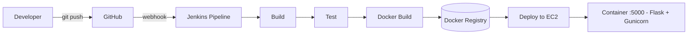

# Architecture — CI/CD Pipeline (GitHub, Jenkins, Docker, EC2)

Automated pipeline: every push to GitHub triggers Jenkins to build, test, containerize and deploy to EC2.

## How it works

- A developer pushes code to GitHub which fires a webhook to Jenkins.
- Jenkins runs the declarative pipeline stages: build, test, then build a Docker image.
- The image is pushed to a container registry.
- Jenkins deploys the container to an Amazon EC2 host, serving the app on port 5000.
