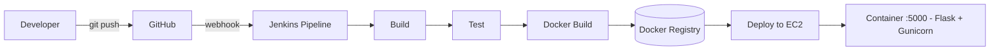

# CI/CD Pipeline with GitHub, Jenkins, Docker & Amazon EC2

> Automated pipeline: **GitHub push -> Jenkins build & test -> Docker image -> deploy to EC2**

An end-to-end Continuous Integration / Continuous Deployment pipeline. Every push
to GitHub triggers a Jenkins job that builds the application, runs tests, packages
it as a Docker image, and deploys the container to an Amazon EC2 host.

---

## Skills Demonstrated
- **Git & GitHub** — source control and webhook triggers
- **Jenkins** — declarative pipeline (Jenkinsfile), stages, credentials
- **Docker** — multi-stage image build and registry push
- **Amazon EC2** — deployment target running the container
- **CI/CD** — automated build, test and deploy flow

---

## Pipeline Flow



> Full diagram details: [ARCHITECTURE.md](ARCHITECTURE.md)

---

## Repository Structure
```
.
├── app/
│   ├── app.py                # Sample Flask application
│   └── requirements.txt
├── Dockerfile                # Container image definition
├── Jenkinsfile               # Declarative CI/CD pipeline
├── docker-compose.yml        # Optional local run
└── README.md
```

---

## Jenkins Setup (summary)
1. Install Jenkins with the Docker, Git and Pipeline plugins.
2. Add credentials: Docker registry (`dockerhub-creds`) and EC2 SSH key (`ec2-ssh`).
3. Create a **Pipeline** job pointing to this repo's `Jenkinsfile`.
4. Add a GitHub webhook: `http://<jenkins-host>/github-webhook/`.
5. Push to `main` — the pipeline runs automatically.

---

## Run Locally
```bash
docker build -t sample-app .
docker run -p 5000:5000 sample-app
# visit http://localhost:5000
```

---

## Author
**Dipak Kuthe** — DevOps / Cloud Engineer
